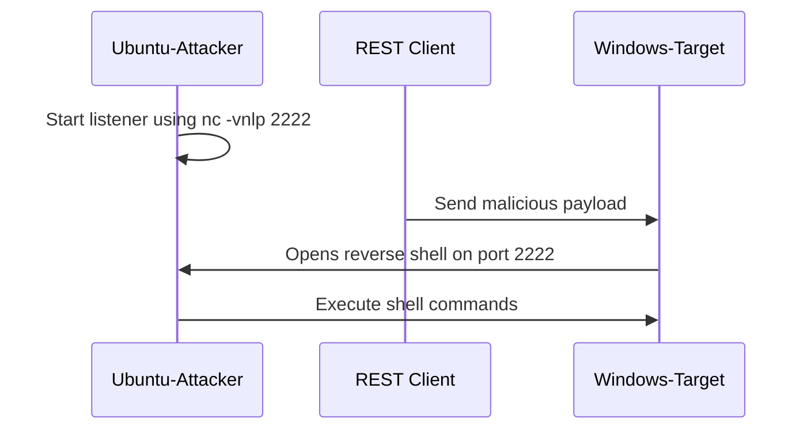

Documenation for this repo is available at:

[Github Pages Documentation](https://johniwasz.github.io/rce-serialization-dotnet/)

Testing mermaid.

```mermaid
sequenceDiagram    
    Ubuntu-Attacker->>Ubuntu-Attacker: Start listener using nc -vnlp 2222
    REST Client->>Windows-Target: Send malicious payload
    Windows-Target->>Ubuntu-Attacker: Opens reverse shell on port 2222
    Ubuntu-Attacker->>Windows-Target: Execute shell commands
```