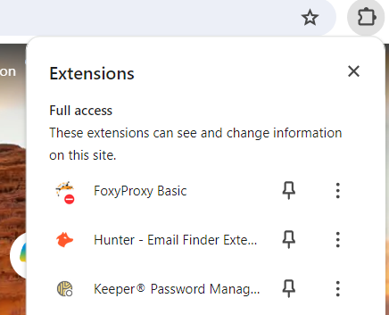

# Install and Configure Burp Suite Community Edition

This section covers how to install Burp Suite and configure it for use with a proxy and certificate.

## Install and Launch Burp Suite

1. Download and install [Burp Suite Community Edition](https://portswigger.net/burp/releases#community). This also requires user registration at [PortSwigger](https://portswigger.net).

1. Launch Burp Suite. Community Edition allows only in-memory project. Click _Next_.

1. Leave _Use Burp Defaults_ selected and click _Start Burp_. 

## Configure Proxy

1. Add _FoxyProxy Basic_ browser add-in for your preferred browser.

1. Launch _FoxyProxy Basic_.

    

1. Select Options.

    

1. Add a proxy with the following settings and click _Save_.  
  
    | Setting  | Value | Description |
    | -------- | ------- | ------- | 
    | Title | Hackz | Name of the proxy |
    | Hostname | 127.0.0.1 | Local host |
    | Port | 8080 | Default port for Burp Suite |

    

1. Enable the Hackerz Proxy. Browsing any non-local site will result in a "No Internet" connection error until Burp Suite is started. Select _Disable_ when done with Burp Suite.

    

## Configure the Burp Suite Certificate

1. Return to the browser with _FoxyProxy Basic_ enabled and navigate to http://burpsuite.

1. Click _CA Certificate_. Save the certificate locally.

    

1. Right-click on the certificate in Windows Explorer and select _Install Certificate_.

    

1. Leave _Current User_ selected and click _Next_.

1. Select _Place all certificates in the following store_, click _Browse_ and select the _Trusted Certificate Authorities_ store. Click _Next_.

    

1. Click _Finish_.

## Confirm Proxy Capture in Burp Suite

1. Return to the browser with _FoxyProxy Basic_ enabled and navigate to https://demo.owasp-juice.shop/ or http://localhost:88 if running the container.

1. Return to Burp Suite and navigate to the _Proxy_ | _HTTP History_ tab. This will show the requests and will be a launching point for penetration testing.

    