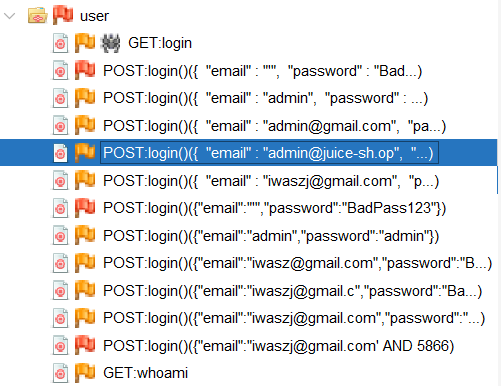
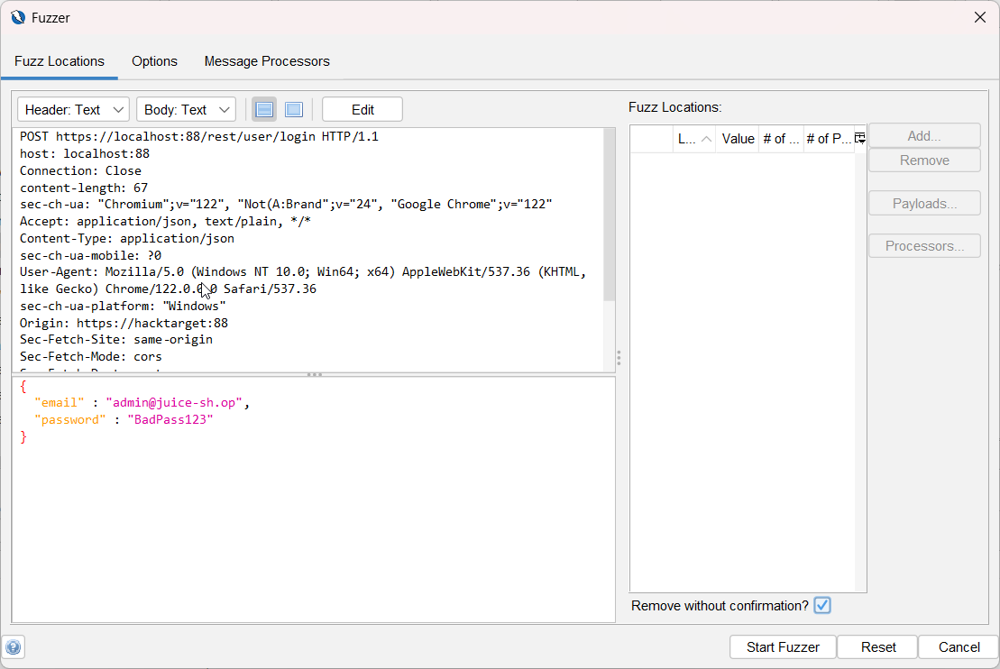
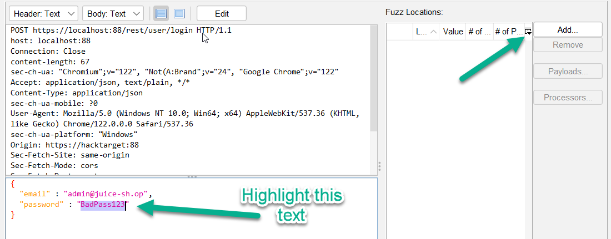
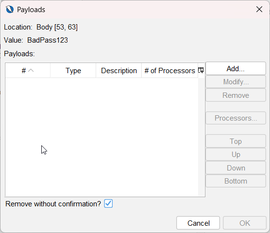
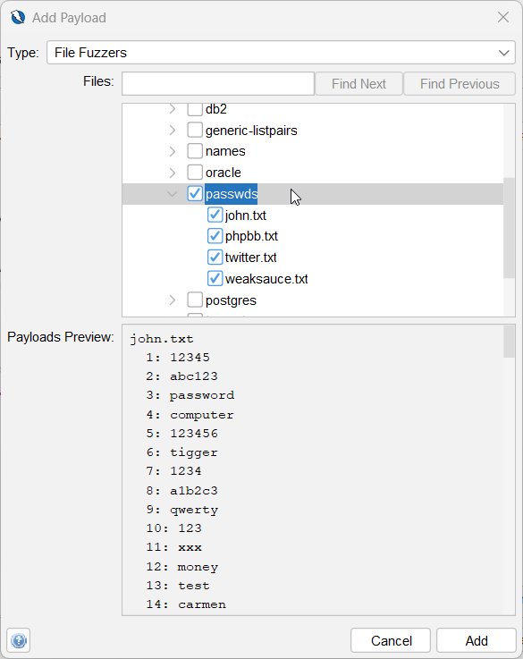
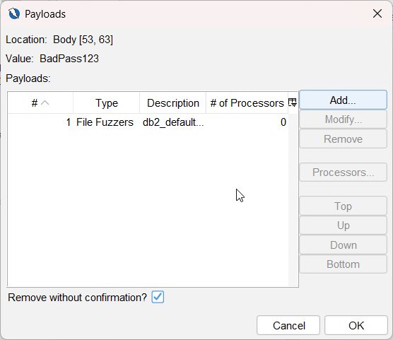
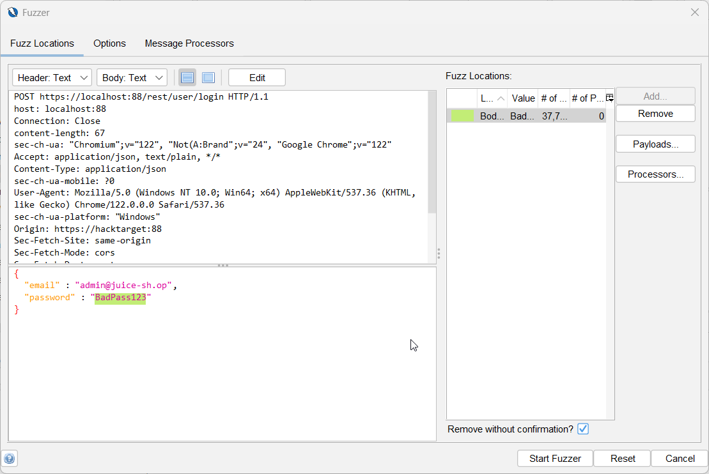
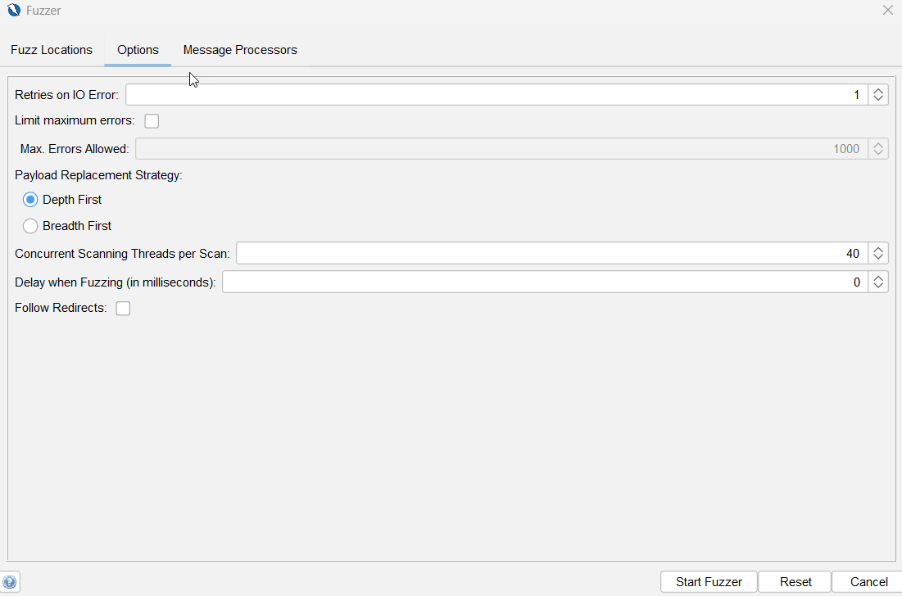
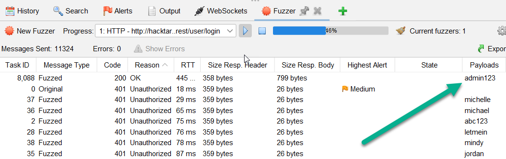

# Cracking Passwords

The SQL Injection vulnerability exercise revealed the `admin@juice-sh.op` hashed password. This section details how to compromise the admin password. There is more than one approach.

The hashed password is:

`0192023a7bbd73250516f069df18b500`

| Hashing Algorithm | Character length of hash |
| ---  | ----------  |
| MD5 | 32 |
| SHA-1 | 40 |
| SHA-256 | 64 |

This password hash is 32 characters long and so we will assume this is an MD5 hash.

## Use Online Tool

There are multiple online tools for decrypting insecure hashes. Using this [online tool](https://10015.io/tools/md5-encrypt-decrypt) decrypts the password as `admin123`.

## Fuzzing in ZAP

This uses a brute force approach in ZAP to send multiple requests using fuzzing.

1. In ZAP, navigate to the rest -> user subfolder under the url of the Juice Shop attack target.

1. Right click on one of the attempts to log in. Right-click on a node under the user subfolder and select Attack | Fuzz.

    

1. Make sure the user name is the admin email address. If necessary, click `Edit` and manually update the email parameter value to `admin@juice-sh.op`. Click Save.

    

1. Highlight the value in the password field and click `Add`.

    

1. This dialog is used to select which set of values will be used to replace the text that was highlighted earlier.

    

1. Select `File Fuzzers` from the drop down. Expand `fuzzdb`-> `wordlist-user-passwd`. Check `passwds`. Click Add.

    

1. The File Fuzzer is now configured. Click OK.

    

1. Before kicking off the fuzz test. Navigate to the `Options` tab.

    

1. Uncheck the `Limit maximum errors` check box. Click `Start Fuzzing`.

    

1. Wait until the fuzz attack executes over 8,500 times. Sort by the `Code` column. Observe that a 200 response was returned when the correct password was sent. Stop the attack.

    
