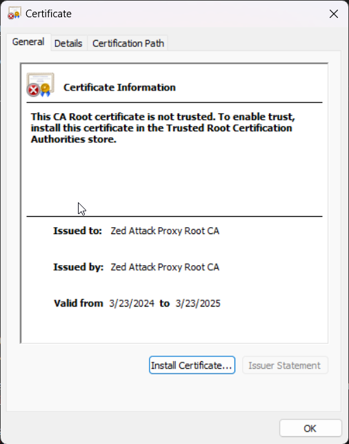

# ~~OWASP~~ Zed Attack Proxy (ZAP)


1. If the Java Runtime environment is not already installed. Download it from [https://www.java.com/en/download/](https://www.java.com/en/download/). If Maltego is already installed, then it is already available. See the Maltego Java Config Windows desktop application for the location of the JRE used by Maltego. 

1. Download the Windows 64-bit OWASP ZAP installer at [https://www.zaproxy.org/download/](https://www.zaproxy.org/download/).

1. Open Chrome or your preferred browser.

1. Add _FoxyProxy Basic_ browser add-in for Chrome or your preferred browser.

1. Launch _FoxyProxy Basic_.

    

1. Select Options.

    

1. Add a proxy with the following settings and click _Save_.  
  
    | Setting  | Value | Description |
    | -------- | ------- | ------- | 
    | Title | ZAP | Name of the proxy |
    | Hostname | 127.0.0.1 | Local host |
    | Port | 8081 | Proxy for ZAP |

    

1. Enable the ZAP Proxy. Browsing any non-local site will result in a "No Internet" connection error until ZAP is started and configured for port 8081. Select _Disable_ when done with ZAP.

    

1. Open Zap and navigate to Tools | Options. In the list of options, select  Network | Local Servers/Proxies. Change the port to 8081.

    

1. Navigate to Network | Server Certificates. Click _View_.

    

1. Click _Install Certificate_.

    

1. Leave _Current User_ selected and click _Next_.

1. Select _Place all certificates in the following store_, click _Browse_ and select the _Trusted Certificate Authorities_ store. Click _Next_.

    

1. Click _Finish_. The browser using Foxy Proxy may need to be restarted for the certificate to take effect.

1. Navigate to [http://zap/](http://zap/) on the configured browser. This documentation page is a launching point into tutorials and background about the tool.

1. Open Notepad as an Administrator, navigate to C:\Windows\System32\drivers\etc, and open the hosts file.

1. Add the following entry without a comment and save the file.

    ```
    127.0.0.1    juiceshop
    ```
