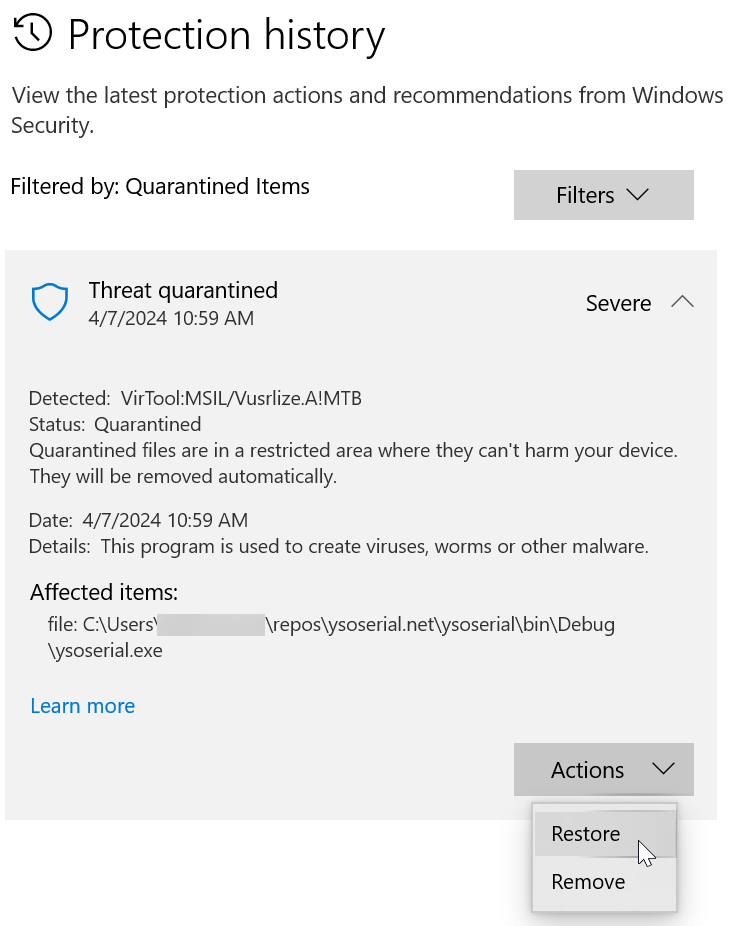

# Serialization Vulnerabilities

Serialization vulnerabilities are not just limited to the `BinaryFormatter`. Any message that includes the type to deserialize poses a threat irrespective of method of serialization. [Newtonsoft.Json](https://www.newtonsoft.com/) and [MessagePack](https://msgpack.org/)[^1] are also susceptible.

[^1]: MessagePack includes [Typeless deserialization](https://github.com/MessagePack-CSharp/MessagePack-CSharp?tab=readme-ov-file#typeless) which embeds the type to deserialize in the message.

Deserializing messages sent from an untrusted source introduces risk. Compromised messages processed by unsafe deserializers could result in an error at best or a remote code execute exploit at worst. OWASP defines this as:

>Data which is untrusted cannot be trusted to be well formed. Malformed data or unexpected data could be used to abuse application logic, deny service, or execute arbitrary code, when deserialized[^2].

[^2]: [Deserialization of Untrusted Data](https://owasp.org/www-community/vulnerabilities/Deserialization_of_untrusted_data?WT.mc_id=MVP_337682)

This project demonstrates serialization vulnerabilities using Json.NET and the BinaryFormatter.

The Todo project is based on the starter tutorial available here:

[Create a controller based API](https://learn.microsoft.com/en-us/aspnet/core/tutorials/first-web-api?view=aspnetcore-7.0&tabs=visual-studio&WT.mc_id=MVP_337682)

These examples were assembled based on serialization vulnerabilities highlighted in the [ysoserial.net](https://github.com/pwntester/ysoserial.net) git repo.

## Deserialization and Gadget Chains

Most serialization exploits utilize two components.

- Type Specification. Messages that define the type to deserialize allow the caller use a vulnerable type.
- Gadget. An exploitable type that includes a capability to launch a command specified in the message.

Exploitable types are referred to as **gadgets**. These allow malicious code to be launched using a constructor, property, method, or a code snippet. **Gadgets** can be a native class or injected into the application. These may not be obvious if a class has a deeply nested hierarchy. In C#, classes that include `object` types or generics can be suspectable. For example, many public APIs include a capability to store metadata or arbitrary data that's captured with a `Dictionary<string, object>`. This opens a door for potential exploitation.

## Prerequisites

Install [Visual Studio 2022](https://learn.microsoft.com/en-us/visualstudio/install/use-command-line-parameters-to-install-visual-studio?view=vs-2022&WT.mc_id=MVP_337682).

Install .NET Framework 4.8.1:

``` bat
winget install Microsoft.DotNet.Framework.DeveloperPack_4 -v 4.8.1
```

Install .NET 8:

``` bat
winget install Microsoft.DotNet.SDK.8
```

Install Git:

``` bat
winget install Git.Git
```

### Ysoserial.net

[Ysoserial.net](https://github.com/pwntester/ysoserial.net) creates malicious serialized payloads for a variety of libraries including [Json.NET](https://www.newtonsoft.com/json), MessagePack, and BinaryFormatter.

The payloads cannot be programmatically generated using these serializers with native implementations. Ysoserial.net manipulates the serialized message to inject a malicious payload. Deserialization results in a runtime exception; however, a remote code execution exploit is triggered.

1. Enable .NET 3.5 on Windows using the instructions here: [Enable .NET 3.5 on Windows](https://learn.microsoft.com/en-us/dotnet/framework/install/dotnet-35-windows?WT.mc_id=MVP_337682). This is required to build ysoserial.net. It exploits vulnerabilities in prior versions of the .NET Framework.

1. Open a command prompt and navigate to:

    ``` bat
    %userprofile%\source\repos
    ```

1. Clone the ysoserial.net repo.

    ``` bat
    git clone https://github.com/pwntester/ysoserial.net.git
    ```

1. Open the solution in Visual Studio and build.

1. Navigate to the debug directory in a command prompt.

    ``` bat
    %userprofile%\source\repos\ysoserial.net\ysoserial\bin\Debug
    ```

1. Execute `ysoserial --help`. The executable may not be available. It is considered malware by most malware scanners. Check Windows Security or your active malware scanner for detected threats and remove `ysoserial.exe` from quarantine.

    a. If `ysoserial.exe` is not available, navigate to Windows Security and select Virus & Threat Protection. Review threat history and find `ysoserial.exe`. Select Action | Restore.

    

    b. Alternatively, ysoserial can be excluded from threat protection using these instructions: [Add an exclusion to Windows Security](https://support.microsoft.com/en-us/windows/add-an-exclusion-to-windows-security-811816c0-4dfd-af4a-47e4-c301afe13b26?WT.mc_id=MVP_337682).

1. Optionally, add the Debug directory to your %PATH%.

Take a moment to review the [Usages](https://github.com/pwntester/ysoserial.net?tab=readme-ov-file#usage) of `ysoserial` parameters before embarking into the projects.

### Clone rce-serialization-dotnet Repo

The [rce-serialization-dotnet](https://github.com/johniwasz/rce-serialization-dotnet) repo includes the serializations projects and this documentation.

1. Open a command prompt and navigate to:

    ``` bat
    %userprofile%\source\repos
    ```

1. Clone the rce-serialization-dotnet repo.

    ``` bat
    git clone https://github.com/johniwasz/rce-serialization-dotnet.git
    ```

The projects are in the `src` subdirectory.

## Serialization Vulnerability Repros

Each project reproduces a serialization vulnerability.

| Project | Description |
| --- | --- |
| [01-BinaryFormatterVulnerabilities](./BinarySerialization.md) | BinaryFormatter vulnerability in .NET Framework 4.8 |
| [02-Framework-JsonVulnerabilities](./JSONSerialization.md) | Json.NET vulnerability in .NET Framework 4.8 |
| [03-.NET-JsonVulnerabilities](./NET8JSON.md) | Json.NET vulnerability in .NET 8 |

Load the solution in each project in Visual Studio, run the solution, and use the requests.http in the Solution Items folder to walk through the vulnerabilities.
